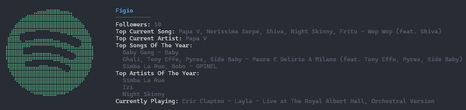

# Spotifetch

Like noefetch, but for your Spotify stats (and for Windows).

Written in Powershell 7.

## Usage

Create a `config.json` file and place in `spotifetch` folder.

`config.json` should have this structure:

```json
{
  "client_id": "<your_client_id>",
  "client_secret": "<your_client_secret>",
  "redirect_url": "<your_redirect_url>"
}
```

To get `client_id` and `client_secret` you should create a new application in the [Spotify Developer Page](https://developer.spotify.com/).

In the settings for your application you must specify a redirect uri (e.g. `http://localhost:12001/callback`).
In your config folder you should set `redirect_url` to the same value except for `/callback`. (e.g. `http://localhost:12001`).
It is important that the redirect url points to localhost, as the script will automatically set up a listener that handles Spotify's OAuth 2.0.

To launch use

```
.\path\to\spotifetch.ps1
```

---



*Excuse my horrendous music taste getting exposed in this screenshot.*
